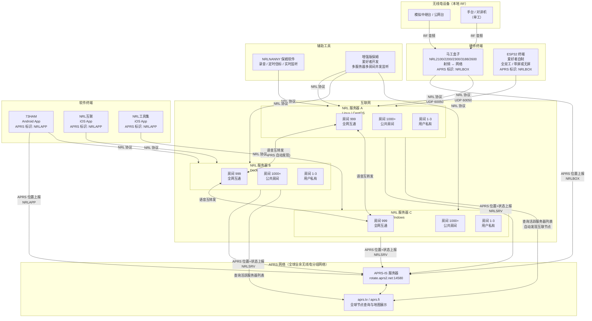
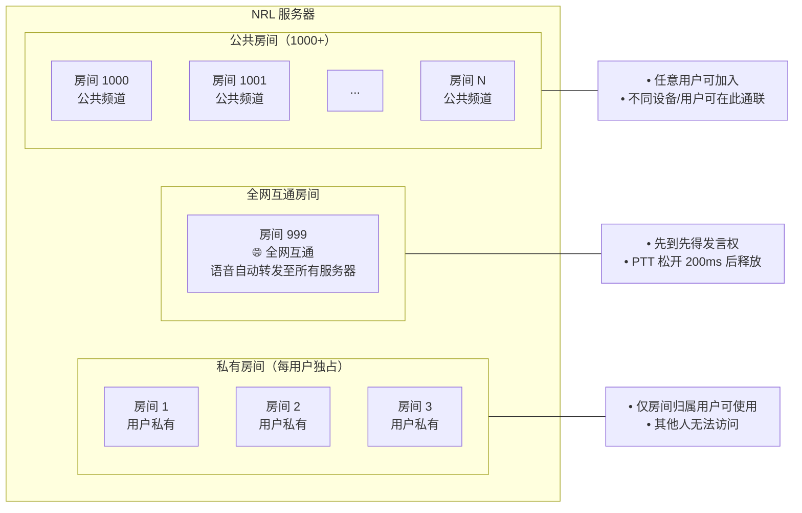
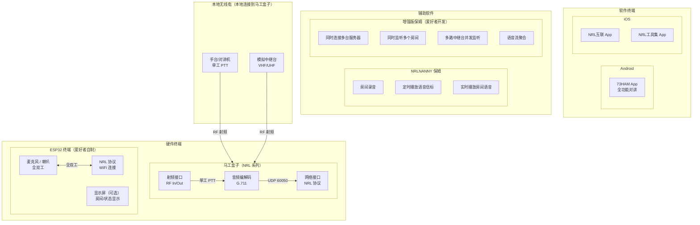
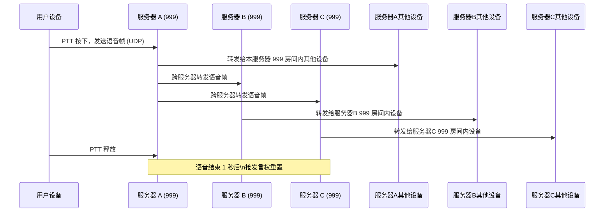
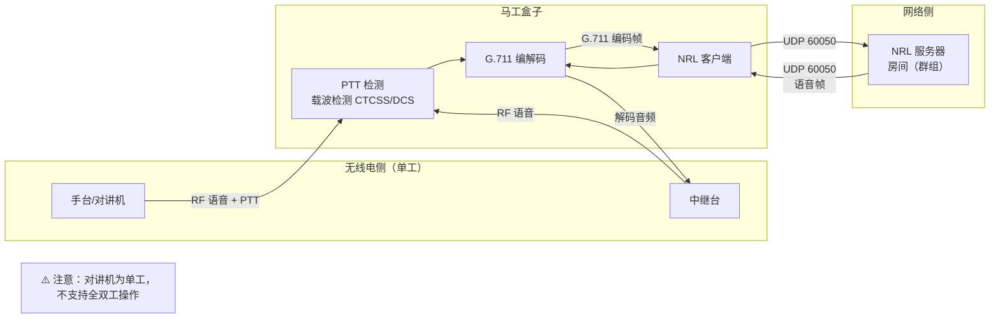
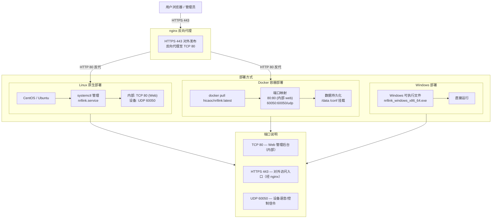
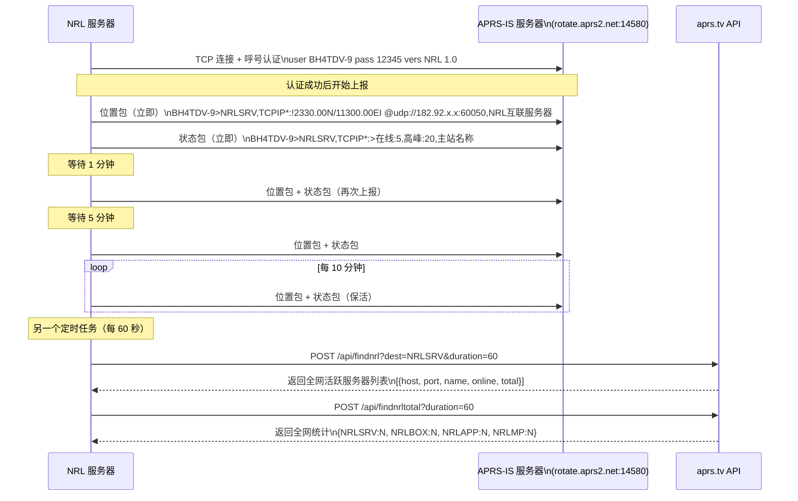
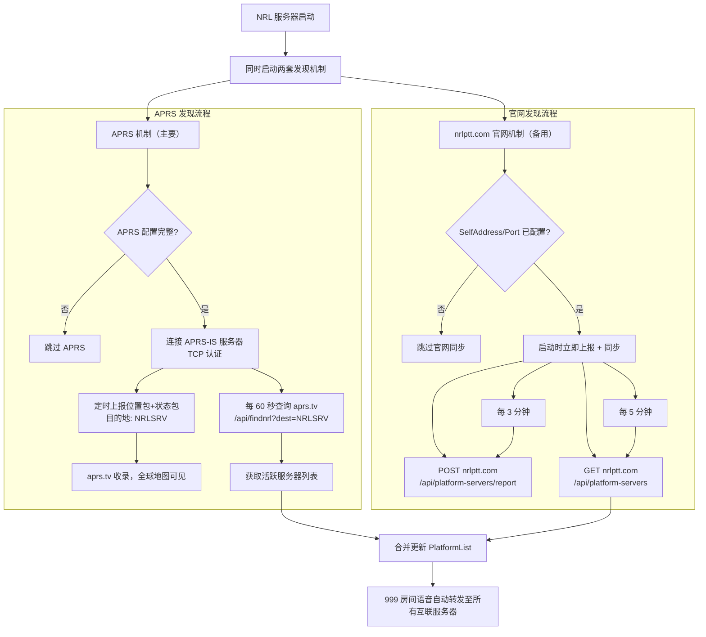

# NRL 系统架构文档

> NRL (Network Radio Link) —— 通过网络连接无线电，实现跨地域、跨设备的语音互联系统

---

## 一、系统总览



---

## 二、服务器房间（群组）结构



### 房间类型说明

| 房间范围 | 类型 | 访问权限 | 说明 |
| --- | --- | --- | --- |
| 1 – 3 | 用户私有 | 仅该用户 | 每个用户独享，外人无法进入 |
| 4 – 996 | 保留号段 | — | 不作为私人、内置或公共房间使用 |
| 997 | 未分配 | — | 暂不归入任何房间范围 |
| 998 | 内置鹦鹉房间 | 所有用户 | 每台设备独立录制并回放自己的语音，不受在线设备数影响 |
| 999 | 全网互通 | 所有服务器用户 | 发言后自动转发至所有互联服务器的 999 房间 |
| 1000+ | 公共房间 | 所有用户 | 多用户多设备在同一房间内通联 |
| 任意 | 会议模式 | 同房间用户 | 开启后切换为全双工 PCM 混音模式 |

### 发言机制详述

语音发言模式由**在线设备数**和**房间类型**共同决定，服务器自动切换，无需手动配置。

#### 按在线设备数自动切换

| 在线设备数 | 模式 | 行为说明 |
| --- | --- | --- |
| 1 台 | 静默 | 普通房间不再自动录音回放 |
| 2 台 | 📞 自动全双工 | 服务器自动切换为全双工模式；ESP32 / App 类终端无需按住 PTT，可像电话一样自由通联 |
| 3 台及以上 | 📻 默认单工 | 先到先得抢占发言权，PTT 松开后 **200ms** 释放，其他设备方可发言 |

内置 998 鹦鹉房间不使用上述按在线设备数切换的规则：无论房间内有多少设备，每台设备都只会录制、回放自己的语音。

> 所有模式下语音释放时间均为 **200ms**（松开 PTT 后）。

#### 会议模式（Conference Mode）

任意房间均可由管理员开启会议模式，开启后覆盖上述单工/全双工规则：

- **服务器端 PCM 混音**：对同时到达的多路音频进行实时叠加混音
- **全双工广播**：混音结果转发给房间内所有在线设备
- **无发言抢占**：所有人可同时讲话，互不阻塞

---

## 三、设备与客户端



---

## 四、全网互通（999 房间）数据流



---

## 五、马工盒子射频桥接数据流



---

## 六、部署架构



---

## 七、系统组件清单

### 服务器端

| 组件 | 说明 |
| ---- | ---- |
| NRL 服务器 | 核心中转服务，管理房间/设备/用户，转发语音帧 |
| Web 管理后台 | 用户注册、设备管理、房间配置（内部 TCP 80，经 nginx HTTPS 443 对外发布） |
| 信令/语音通道 | UDP 60050，低延迟语音转发 |
| SQLite 数据库 | 用户、设备、群组、日志持久化存储 |
| 服务器互联模块 | 999 房间跨服务器语音转发 |

### 硬件终端

| 设备 | 型号 | 特性 |
| ---- | ---- | ---- |
| 马工盒子 | NRL2100/2200/2300/3188/2600 | 射频桥接，单工，G.711 编解码 |
| ESP32 终端 | 爱好者自制 | 全双工，可选显示屏，WiFi 连接 |

### 软件终端

| 平台 | 应用 | 说明 |
| ---- | ---- | ---- |
| Android | 73HAM | 全功能 NRL 对讲客户端 |
| iOS | NRL互联 | iOS NRL 客户端 |
| iOS | NRL工具集 | iOS NRL 工具客户端 |

### 辅助软件

| 软件 | 功能 |
| ---- | ---- |
| NRLNANNY 保姆 | 房间录音、定时语音信标播放、实时语音监听 |
| 增强版保姆 | 同时连接多服务器多房间、多路中继台并发监听、语音聚合 |

---

## 八、典型应用场景

### 场景一：本地中继台接入全网

```text
本地中继台 → 马工盒子 → NRL服务器A(999房间) → 所有互联服务器(999) → 全网用户
```

### 场景二：手机用户与无线电用户通联

```text
手机 73HAM App → 服务器B(1000号房间) ← ESP32终端 ← 本地对讲机(通过马工盒子)
```

### 场景三：爱好者监听多地中继台

```text
增强版保姆 → 同时连接 服务器A(999) + 服务器B(1000) + 服务器C(1001)
           → 各服务器对应连接了不同地区的中继台
           → 实现多地中继台同步监听
```

### 场景四：用户私有通信

```text
用户设备A(房间1) → 服务器(房间1，私有) → 用户设备B(同一用户，房间1)
外部用户无法进入 1-3 号房间
```

---

## 九、APRS 集成与自动发现

### 9.1 APRS 是什么

APRS（Automatic Packet Reporting System，自动分组报告系统）是业余无线电领域广泛使用的实时数字通信网络，可传播位置、状态、消息等信息，并通过互联网网关（APRS-IS）实现全球汇聚。NRL 系统利用 APRS-IS 实现节点的自动发布与发现，无需手动配置服务器列表。

### 9.2 各类节点的 APRS 标识（Destination / tocall）

| APRS 目的地标识 | 对应节点类型 |
| -------------- | ----------- |
| `NRLSRV` | NRL 服务器 |
| `NRLBOX` | 马工盒子及爱好者自制硬件终端（ESP32 等） |
| `NRLAPP` | Android / iOS 手机 App（73HAM、NRL互联等） |
| `NRLMP` | 微信小程序客户端 |

### 9.3 服务器 APRS 上报机制



### 9.4 APRS 数据包格式说明

**位置包**（让全球爱好者在 aprs.fi / aprs.tv 地图上看到服务器位置）：

```text
BH4TDV-9>NRLSRV,TCPIP*:!2330.00N/11300.00EI @udp://182.92.158.141:60050,NRL互联服务器
```

| 字段 | 说明 |
| ---- | ---- |
| `BH4TDV-9` | 呼号-SSID（运营者的业余无线电呼号） |
| `NRLSRV` | APRS 目的地标识，用于过滤查询 NRL 服务器 |
| `TCPIP*` | 经由 APRS-IS 互联网网关发送 |
| `!...I` | 位置格式（纬度/经度，I 为符号代码） |
| `@udp://...` | 服务器接入地址，供其他节点自动解析连接 |

**状态包**（上报实时在线数据）：

```text
BH4TDV-9>NRLSRV,TCPIP*:>在线:5,高峰:20,我的NRL平台
```

| 字段 | 说明 |
| ---- | ---- |
| `在线:5` | 当前在线设备数 |
| `高峰:20` | 历史最高同时在线设备数 |
| `我的NRL平台` | 平台自定义名称 |

### 9.5 双机制服务器自动发现流程

NRL 服务器通过两套机制并行发现其他服务器，互为补充：



| 对比项 | APRS 机制 | nrlptt.com 官网机制 |
| ------ | --------- | ------------------- |
| 定位 | 主要机制 | 备用机制 |
| 上报周期 | 立即 → 1分钟 → 5分钟 → 每10分钟 | 启动立即，之后每 3 分钟 |
| 同步周期 | 每 60 秒（查询 aprs.tv） | 启动立即，之后每 5 分钟 |
| 中转服务 | APRS-IS + aprs.tv | nrlptt.com 官网直连 |
| 附加功能 | 含 GPS 位置，全球地图可见 | 仅服务器列表 |
| 需要配置 | 呼号、位置、APRS 服务器 | 仅 SelfAddress + SelfPort |

### 9.6 APRS 配置参数

| 配置项 | 说明 | 示例 |
| ------ | ---- | ---- |
| `APRSServerHost` | APRS-IS 服务器地址 | `rotate.aprs2.net` |
| `APRSServerPort` | APRS-IS 服务器端口 | `14580` |
| `CallSign` | 运营者业余无线电呼号 | `BH4TDV` |
| `SSID` | 副台标识（区分同一呼号的不同设备） | `9` |
| `Passcode` | APRS 认证码（留 0 则自动由呼号计算） | `0` |
| `SelfAddress` | 本服务器公网 IP / 域名（用于自身过滤） | `182.92.158.141` |
| `SelfPort` | 本服务器 UDP 端口 | `60050` |
| `Latitude` | 服务器所在地纬度（十进制度） | `23.5` |
| `Longitude` | 服务器所在地经度（十进制度） | `113.0` |
| `Altitude` | 高度（可选） | `50` |

### 9.7 爱好者如何通过 APRS 找到 NRL 节点

1. 访问 [aprs.tv](https://aprs.tv) 或 [aprs.fi](https://aprs.fi)
2. 搜索 APRS 目的地 `NRLSRV`（服务器）、`NRLBOX`（盒子）、`NRLAPP`（App）
3. 地图上可见所有活跃节点的位置、呼号、在线人数
4. 点击节点可查看接入地址（`udp://IP:60050`），输入 App 即可直接连接

### 9.8 nrlptt.com 官网服务器发现机制

服务器启动后自动向 `https://nrlptt.com` 官网上报自身信息，同时从官网下载全网服务器列表，作为 APRS 机制的补充/备用。

**上报接口（POST）：**

```text
POST https://nrlptt.com/api/platform-servers/report
Content-Type: application/json

{"name":"平台名称","host":"182.92.x.x","port":"60050","online":5,"total":20}
```

**获取列表接口（GET）：**

```text
GET https://nrlptt.com/api/platform-servers
```

返回全网所有已注册的 NRL 服务器列表，系统自动解析 `host:port`、过滤自身后加入互联转发列表。

| 字段 | 说明 |
| ---- | ---- |
| `name` | 平台名称（取 PlatformName 或 NameShorthand） |
| `host` | 服务器公网 IP 或域名 |
| `port` | UDP 语音端口（通常为 60050） |
| `online` | 当前在线设备数 |
| `total` | 历史最高在线设备数（峰值） |

---

## 十、协议与技术规格

| 项目 | 规格 |
| ---- | ---- |
| 传输协议 | UDP（语音/控制），TCP（Web 管理） |
| 语音编码 | G.711 (a-law) |
| 语音端口 | UDP 60050 |
| Web 端口（内部） | TCP 80 |
| Web 端口（对外） | HTTPS 443，经 nginx 反向代理 |
| 发言机制 | 抢占制（先到先得，语音结束后 1 秒释放） |
| 混音支持 | 会议模式（服务器端多路混音，不适用于 999 房间） |
| 数据存储 | SQLite |
| 容器支持 | Docker (`hicaoc/nrllink:latest`) |
| 系统支持 | Linux、Windows、Docker |
| APRS 上报周期 | 立即 → 1 分钟 → 5 分钟 → 之后每 10 分钟 |
| APRS 服务发现周期 | 每 60 秒查询 aprs.tv，自动更新互联服务器列表 |
| APRS 节点类型标识 | NRLSRV（服务器）/ NRLBOX（硬件）/ NRLAPP（App）/ NRLMP（小程序） |
| 官网上报周期 | 启动立即，之后每 3 分钟（POST nrlptt.com） |
| 官网同步周期 | 启动立即，之后每 5 分钟（GET nrlptt.com） |
